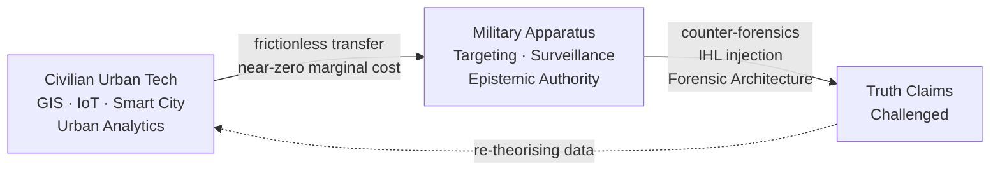
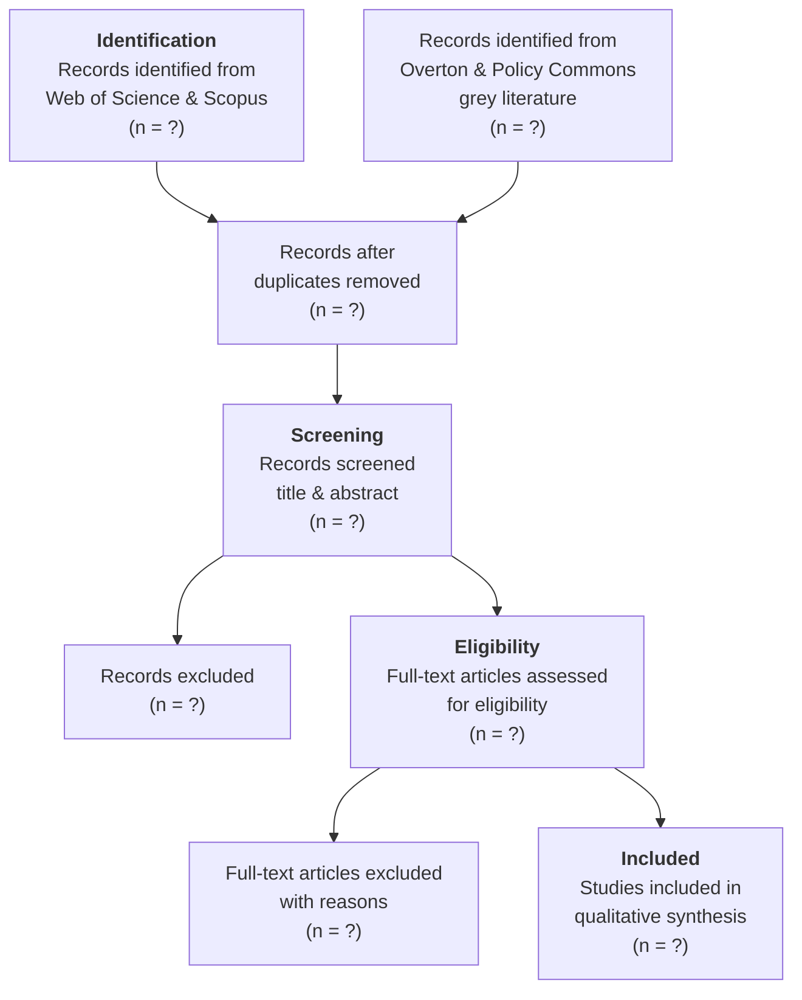

---
tags:
  - MSc_PPM
  - Dissertation_MSc
---

Date: Wednesday 10th June, 2026
Word count: ~2900
# Introduction: The Algorithm and the City

The contemporary urban landscape is increasingly defined by an imperative toward "smartness" (Cugurullo et al., 2024). Propelled by a confluence of digital technologies—spatiotemporal tracking, the Internet of Things (IoT), and Big Data analytics—city planners and policymakers have embraced algorithmic solutions to tackle the complex challenges of sustainable urbanisation (Kitchin, 2014; Townsend, 2013). Conceptually, the "Smart City" paradigm rests on a tripartite promise of sustainability, economic context-awareness, and social inclusiveness (Arroub et al., 2016). In pursuit of these ideals, the modern city has been transformed into a living laboratory, utilising local testbeds and technology incubators to decode the urban environment into actionable intelligence. Yet, this techno-utopian approach to urban management relies on a process of *transduction*—the translation of the physical city and its populace into programmable code. In doing so, technology transcends its role as a mere administrative tool; the algorithms embedded in these experiments function as profound governing mechanisms, allowing states and corporations to exercise power and "govern at a distance."

Despite the pervasive integration of Artificial Intelligence and urban analytics into public policy, democratic oversight has struggled to keep pace. As Pasquale (2015) warns, society is heavily skewed to the advantage of "black box insiders," leaving the populace ignorant of how its key institutions actually function. Driven by a desire for fiscal prudence, governments are increasingly tempted by the promise of replacing expensive human decision-making with cheap, supposedly objective computational logic. Treating algorithmic management as politically neutral, however, risks a dangerous fall into "dataism"—the widespread belief in the objective quantification and potential tracking of all human behaviour as a source of truthful, neutral knowledge (van Dijck, 2014)—wherein the socio-political dynamics of governance are entirely sidelined.

This creates a pressing policy crisis, primarily because the algorithmisation of civic management is inherently a "dual-use" enterprise. This dynamic is perfectly, and controversially, illustrated by the UK government's recent award of the £330 million NHS Federated Data Platform contract to Palantir Technologies. Palantir—a defence contractor originally backed by the CIA's In-Q-Tel, whose foundational software was forged tracking insurgent networks in Iraq and Afghanistan—now provides the ontological architecture for civilian health management. This crossover demonstrates the frictionless mobility of software as an "information good" (cf. Arrow, 1962). Because algorithmic models possess a near-zero marginal cost of reproduction, the exact same data ontology used to map hostile actors on a battlefield is effortlessly retrofitted to manage hospital backlogs and patient flows. When military-security apparatuses become embedded in civilian infrastructure, it profoundly alters the governmentality of the state.

Conversely, the exact mechanism occurs in reverse: civilian urban technology is seamlessly weaponised in conflict zones to execute systemic spatial destruction. In his analysis of civil-military relations, Kobi Michael (2007) identified a profound breakdown in the Israeli "discourse space." He argued that civilian politicians, crippled by "strategic helplessness," effectively abdicated their responsibility to chart a political endgame. Into this void stepped the military, claiming the role of an "epistemic authority"—the absolute arbiter of knowledge and truth. Today, this epistemic authority is no longer reliant on traditional staff-work; it has become intensely algorithmic.

The advent of Big Data ushered in the dangerous, positivist assumption that massive datasets allow correlation to supersede causation—effectively letting "data speak for itself" and rendering theory obsolete (cf. Anderson, 2008). In the ongoing systemic destruction of Gaza, the military utilises the "God's Eye View" of remote sensing, machine learning, and GIS—the very tools of peacetime urban planning—to assert epistemic dominance. Civilian politicians are easily seduced by the seeming objectivity of AI-driven target generation and automated damage assessments. Yet, as the spatial analytics documented by [Forensic Architecture](https://forensic-architecture.org) reveal, this data merely masks a profound lack of political strategy with data-driven, tactical dominance. Algorithms are optimising mechanisms designed to solve tactical problems (e.g., locating a target, engineering an evacuation grid, clearing a designated percentage of territory); they cannot formulate a strategic political resolution:

Furthermore, as their counter-forensics proved, spatial data cannot speak for itself. To translate the correlation of airstrikes and destroyed medical infrastructure into the truth of *domicide*, one must use the theoretical and legal framework of International Humanitarian Law (IHL) to interpret what the data indicates. In the case of the conduct of the IDF since October 2023, the data indicates the systematic destruction of life (Forensic Architecture, 2023).

Addressing this threat in public policy requires piercing the black box of dual-use data analytics. We must understand how the literature tracks this shift from traditional institutional, *disciplinary* governance to algorithmic societies of control (Deleuze, 1990), and how the tools of urban optimisation are simultaneously the instruments of urbicide.
In his influential essay Deleuze poignantly observed:

> The numerical language of control is made of codes that mark access to information, or reject it. We no longer find ourselves dealing with the mass/individual pair. Individuals have become "_dividuals_," and masses, samples, data, markets, or "_banks_."

***

# Methodology: A systematic mapping of the literature on algorithmisation, 1990–2025

To empirically investigate the intersection of algorithmic governance, urban space, and systemic spatial destruction (domicide), this dissertation will deploy a Systematic Literature Review (SLR). To avoid the epistemological pitfalls of a traditional narrative literature review, which inherently risks selection bias and the "cherry-picking" of sources to validate a pre-existing theoretical critique, an SLR methodology provides a transparent, auditable, and reproducible mechanism for data collection. This aligns with the "evidence turn" in contemporary public policy and management, which increasingly demands structured methodologies to track policy evolution and evaluate "what works" (Tranfield et al., 2003). However, rather than evaluating the effectiveness of a specific policy intervention, this SLR is adapted to rigorously map a longitudinal *discursive shift*. It aims to comprehensively track how global academic discourse and policy literature have conceptualised algorithms, big data, and spatial surveillance over the past three and a half decades.

The core premise motivating these search parameters is the hypothesis that the *algorithmisation* of public policy possesses an inherently "dual-use" nature that distinguishes it fundamentally from the management of physical urban infrastructure. While the build-out of legacy urban assets—such as highways, rail networks, or gas terminals—requires massive capital expenditure, physical friction, and explicit geographic constraints, software and algorithmic management operate under entirely different economic and physical mandates. Drawing on Kenneth Arrow's foundational economic concept of the "information good" (Arrow, 1962), software is characterised by a high initial cost of development but a near-zero marginal cost of reproduction and deployment. Unlike physical infrastructure, a geographic information system (GIS) or an AI-driven behavioural prediction algorithm designed for civilian urban planning can be frictionlessly retrofitted for military targeting or spatial unmaking without requiring new physical supply chains. It is precisely this zero marginal cost and frictionless transferability that supercharges the dual-use threat of algorithmic policymaking. To test whether (and how) this phenomenon has been recognised, debated, or obfuscated in policy circles, a rigorous evaluation of the literature is required.

For policymakers, the stakes are concrete. When a municipal government procures a GIS platform or an AI-driven traffic management system, it is—knowingly or not—acquiring a technology governed by the economics of the information good. That same system, transferred to a military context, becomes a targeting apparatus without requiring new supply chains, new procurement, or new infrastructure. The policy question is not whether this dual-use transfer *can* happen, but whether the frameworks of oversight, procurement, and accountability that govern urban technology procurement have even registered the possibility. An SLR is uniquely suited to answer this question: rather than arguing one position, it systematically maps what the global policy conversation has—and has not—accounted for. The findings will serve not as a normative indictment but as an evidence-based diagnostic, identifying precisely where the policy literature has blind spots, and offering a structured foundation for future regulatory and oversight frameworks.

### Research Parameters and the Modified PRISMA Framework

To ensure maximum rigour, this research structures its data collection and analysis around the core sequential phases of a systematic review, utilising a modified PRISMA (Preferred Reporting Items for Systematic Reviews and Meta-Analyses) standard adapted for public policy and theoretical analysis (Page et al., 2021). Each stage of the review—from search execution to final inclusion—will be logged and reported in a completed PRISMA flow diagram, ensuring the final corpus is fully auditable.

**1. Framing the Research Questions and Conceptual Scope**

The preliminary stage of the PRISMA process involves operationalising the core hypotheses into precise research questions that can guide a database search. The primary questions driving this review are twofold:

- **RQ1:** *How has the academic and policy literature from 1990 to 2025 conceptualised the dual-use nature of algorithmic technologies in urban governance, specifically in contrast to traditional physical infrastructure?*
- **RQ2:** *To what extent does the evolving discourse reflect a shift from institutional (disciplinary) management of urban spaces to algorithmic (modulatory) control, and how is this shift implicated in instances of systemic urban destruction or domicide?*

By placing Kenneth Arrow's concept of the information good in dialogue with the Deleuzian hypothesis of societal control, these questions establish a rigid perimeter for the subsequent literature search, ensuring that the collected data speaks directly to the dual-use nature of spatial analytics and the compromised integrity of the private dwelling (King, 2004).

**2. Database Indexing and Search Strategy**
To capture a comprehensive dataset that bridges theoretical scholarship, empirical urban studies, and applied policymaking, this literature review will interrogate a 35-year chronological window spanning from 1990 to 2025. This expansive date range is a deliberate methodological necessity. It allows the review to track the literature across several distinct technological epochs: the advent of the early internet and digitisation of municipal records (circa 1990s), the foundational infrastructure build-out of Web 1.0, the rise of ubiquitous data harvesting and Big Data in Web 2.0, the decentralised shifts of Web 3.0, and the precipice of the ongoing Fourth Industrial Revolution (4IR) defined by generative AI and autonomous systems.

To source peer-reviewed academic literature, the primary databases utilised will be **Web of Science** and **Scopus**, both chosen for their unparalleled breadth across the social sciences, urban planning, and defence studies. Boolean search strings will be constructed to capture the intersection of civilian and military urban paradigms.

Given the novelty and cross-cutting nature of the research inquiry—which bridges urban analytics, security studies, and spatial destruction—a single search string risks being either too restrictive (capturing only papers sitting directly at the intersection of all three domains) or analytically shallow (returning noise without structure). To address this, the review will deploy **two complementary search strategies, merged at the deduplication stage**:

**Search A — Civil-military urban technology nexus (high recall):** Designed to surface the broader landscape of how algorithmic governance, smart city infrastructure, and urban analytics intersect with military, surveillance, and security apparatuses. Following initial scoping against Scopus (which returned an unmanageable c. 10,000 records for the first-draft string), generic terms with high cross-disciplinary noise (`"big data"`, bare `"security"`, bare `"surveillance"`, bare `"targeting"`) have been replaced with qualified equivalents and truncated stems drawn from the critical urban studies vocabulary. The calibrated string is: `("algorithmic governance" OR "urban analytics" OR "smart cit*" OR "platform urbanism" OR "predictive policing" OR "urban big data" OR "data-driven urbanism") AND ("dual-use" OR "civil-military" OR "military" OR militari* OR "national security" OR securitis* OR securitiz* OR weaponi* OR warfare OR "state surveillance" OR "mass surveillance" OR "OSINT")`.

**Search B — Spatial destruction and the datafied city (high precision):** Designed to capture literature specifically addressing how algorithmic and data-driven tools are implicated in urbicide, domicide, and spatial violence. Keywords will include: `("domicide" OR "urbicide" OR "spatial violence" OR "home unmaking" OR "urban destruction" OR "urban warfare") AND ("data" OR "algorithm" OR "AI" OR "surveillance" OR "GIS" OR "remote sensing")`. Initial scoping confirms this search behaves as designed, returning a small, tightly relevant corpus (n = 31 on Scopus). The stark asymmetry between the two searches is itself a provisional finding: the algorithmic-governance and spatial-destruction literatures barely intersect at the level of indexed vocabulary.

Results from both searches will be exported to **Zotero** for reference management and deduplication, then screened together i~~n **Rayyan**~~ using the inclusion/exclusion criteria below. This dual-search approach ensures that papers theorising the surveillance-governmentality nexus (which may not explicitly invoke "domicide") and papers documenting spatial destruction (which may not deploy the language of "algorithmic governance") are both captured in the initial corpus. The convergence—or absence of convergence—between these two literatures is itself a finding the SLR is designed to surface.[^2]

Because the calibration of Search A required removing high-noise generic terms (notably bare "surveillance" and "big data"), the database search will be supplemented by a single iteration of backward and forward **citation chaining** ("snowballing"; Wohlin, 2014) from three to five anchor texts spanning the review’s constituent literatures (provisionally Graham, 2006; Kitchin, 2014; Weizman, 2007). For each anchor, the reference list will be screened for relevant records (backward pass), and Scopus’s "Cited by" index will be screened under the same date and subject filters (forward pass). Snowballed records will enter the same deduplication and screening pipeline as the database results and will be reported separately on the PRISMA flow diagram under identification via other methods. This citation-based discovery mechanism is keyword-independent, providing a structured safeguard against vocabulary blind spots introduced by search-string calibration; the volume of relevant records it surfaces that the database searches missed will additionally serve as a robustness check on the comprehensiveness of the search strategy itself.

Crucially, capturing the reality of modern governance requires supplementing academic databases with robust "grey literature" to record active policy debates. For this, the search will utilise **Overton**[^1] (currently the world's most comprehensive searchable index of global policy documents, parliamentary transcripts, and think-tank outputs) and **Policy Commons**. These specialised repositories offer a far higher degree of rigour than standard search engine queries and will surface white papers from key policy-exchange hubs, defence ministries, and global institutions (e.g., RAND Corporation, The Urban Displacement Project, Chatham House) that shape the contemporary civil-military discourse space. The grey literature search will mirror the dual-search structure above, adapted for the indexing conventions of each platform, with an emphasis on policy documents, parliamentary records, defence white papers, and think-tank outputs that explicitly address the dual-use implications of urban data technologies.

**3. Screening, Quality Appraisal, and Inclusion/Exclusion Criteria**
Once the initial dataset is generated, records will be screened in two sequential passes—first by title and abstract, then by full text—with every exclusion at the full-text stage logged with a stated reason, as the PRISMA flow diagram requires.

* *Inclusion criteria:* Selected texts must be (a) peer-reviewed journal articles, book chapters, or authoritative theoretical texts, or (b) substantive policy documents (white papers, parliamentary reports, think-tank analyses) from identifiable institutional authors; published within the 1990–2025 timeframe; and explicitly addressing the intersection of data technology with public policy, civic governance, urban space, or state control.
* *Exclusion criteria:* The review will strictly exclude literature that focuses purely on the technical, mathematical, or computational mechanics of software engineering (e.g., algorithmic efficiency optimisation or pure computer science papers) lacking any applied reference to public policy, civic governance, the urban environment, or defence strategy. Editorials, conference abstracts without full papers, and journalistic commentary will be excluded. Articles outside of English (unless high-quality translations are available) will also be excluded due to resource constraints; this limitation is acknowledged below.
* *Quality appraisal:* Peer-reviewed status will serve as the baseline quality threshold for academic literature. Grey literature, which lacks peer review, will be appraised using the AACODS checklist (Authority, Accuracy, Coverage, Objectivity, Date, Significance) to filter out advocacy material lacking evidentiary grounding (Tyndall, 2010).

As this is a single-author dissertation, the conventional dual-reviewer screening protocol is not feasible. To mitigate single-reviewer bias, two safeguards will be adopted: a pilot screening of a random 10% sample will be conducted and discussed with the dissertation supervisor to calibrate the application of criteria before full screening begins; and borderline cases will be logged in a decision journal and resolved against the written criteria rather than ad hoc judgement.

**4. Thematic Extraction and Tentative Coding**
Data extracted from the final approved corpus of literature will be logged in a "Systematic Review Map," recording for each text its publication year, discipline, geographic focus, document type, and conceptual orientation. Rather than attempting a quantitative meta-analysis of statistical variables, which would be inappropriate for qualitative policy discourse, this map will inductively and deductively categorise the literature along distinct conceptual axes. While the final codes will evolve iteratively as the literature is reviewed, the initial tentative themes guiding the extraction include:
* *The Information Good and Dual-Use Fluidity:* Tracking how literature recognises the zero marginal cost of algorithmic tools and their frictionless translation from civilian urban tech (e.g., smart city metrics) to military intelligence.
* *Epistemic Authority & Black-Boxing:* Literature dealing with civilian policymakers deferring strategic decision-making to the seeming objectivity of military or corporate data points (bridging Kobi Michael's theory of discourse spaces).
* *The Machinic City and Modulation:* Literature conceptualising urban populations and housing not as static infrastructure, but as dynamic, targetable data fields (utilising De Landa's machinic assemblages).
* *Spatial Collapse and Home Unmaking:* Discourse explicitly connecting the weaponisation of urban planning and algorithmic zoning tools to displacement, urbicide, and the infringement upon the private dwelling (King, 2004).

Because the review tracks a *longitudinal* discursive shift, each coded theme will additionally be plotted against publication date, enabling the synthesis to identify when (and in which discourse communities) dual-use awareness emerges, peaks, or disappears across the 1990–2025 window.

**5. Synthesis, Interpretation, and Limitations**
The final synthetic phase of the review will bridge the empirical findings of the literature map back to the motivating theoretical framework. By critically evaluating how the global literature has historically treated the dual-use capacities of algorithms, this methodology will test the utility of the Deleuzian transition from disciplinary spaces to control societies in modern policy analysis. This systematic synthesis will comprise the substantive core of the dissertation's data chapter, examining whether the obfuscation of the "information good" in policy circles has facilitated the tactical dominance of military analytics. The results will culminate directly in the dissertation's conclusion, delivering a clearly articulated, evidence-backed agenda for future research into public policy frameworks capable of asserting civilian, democratic oversight over algorithmic urban governance.

Four limitations are acknowledged at the outset. First, the English-language restriction risks under-representing discourse from non-Anglophone policy communities, particularly relevant given the geographic foci of the case material; this will be flagged wherever the synthesis makes global claims. Second, single-reviewer screening, while mitigated as described above, cannot fully replicate the inter-rater reliability of team-based reviews. Third, grey literature indexing is structurally uneven—classified or restricted defence documents are by definition absent—meaning the review can map the *public* policy discourse only. Fourth, current access to Overton is via a trial licence that truncates result sets to the first three pages per query; unless full institutional access is secured, grey-literature recall is bounded by the query-decomposition workaround described above, and claims about the policy corpus will be qualified accordingly. Each limitation constrains the scope of the claims the synthesis can support, and the conclusion will be calibrated accordingly.

# working reference List
Arroub, A., Zahi, B., Sabir, E., Sadik, M., 2016. A literature review on Smart Cities: Paradigms, opportunities and open problems, in: 2016 International Conference on Wireless Networks and Mobile Communications (WINCOM). IEEE, pp. 180–186.

Arrow, K.J., 1962. Economic welfare and the allocation of resources for invention, in: Readings in Industrial Economics: Volume Two: Private Enterprise and State Intervention. Springer, pp. 219–236.

Ben-Israel, I., Matania, E., Friedman, L., 2020. The national initiative for secured intelligent systems to empower the national security and techno-scientific resilience: a national strategy for israel. Special Report to The Prime Minister, Hebrew.

Cugurullo, F., Caprotti, F., Cook, M., Karvonen, A., MᶜGuirk, P., Marvin, S., 2024. The rise of AI urbanism in post-smart cities: A critical commentary on urban artificial intelligence. Urban Studies 61, 1168–1182. [https://doi.org/10.1177/00420980231203386](https://doi.org/10.1177/00420980231203386)

De Landa, M., 2014. Intensive Science and Virtual Philosophy (Continuum Impacts) (Transversals: New Directions in Philosophy).

De Landa, M., 1992. War in the age of intelligent machines.

Deleuze, G., 1990. Postscript on the Societies of Control.

Forensic Architecture, 2023. A Cartography Of Genocide: Israel's Conduct In Gaza Since October 2023.

Foucault, M., 2023. Discipline and Punish, in: Social Theory Re-Wired. Routledge.

Giordano, A., 2019. Cartographies of genocide. Abstracts of the ICA 1, 95. [https://doi.org/10.5194/ica-abs-1-95-2019](https://doi.org/10.5194/ica-abs-1-95-2019)

==Graham, S. (Ed.), 2006. Cities, war, and terrorism: towards an urban geopolitics, Nachdr. ed, Studies in urban and social change. Blackwell Publ, Malden, Mass.==

Horowitz, D., 2021. The Israel Defense Forces: A civilianized military in a partially militarized society, in: Soldiers, Peasants, and Bureaucrats. Routledge, pp. 77–106.

King, P., 2004. Private Dwelling, 0 ed. Routledge. [https://doi.org/10.4324/9780203421406](https://doi.org/10.4324/9780203421406)

==Kitchin, R., 2014. Big Data, new epistemologies and paradigm shifts. Big data & society 1, 2053951714528481.==

Lyon, D., 2014. Surveillance and the Eye of God. Studies in Christian Ethics 27, 21–32. [https://doi.org/10.1177/0953946813509334](https://doi.org/10.1177/0953946813509334)

Michael, K., 2017. Special operations forces (SOF) as the "silver bullet": Strategic helplessness and weakened institutional and extra-institutional civilian control, in: Special Operations Forces in the 21st Century. Routledge.

Michael, K., 2007. The Israel Defense Forces as an epistemic authority: An intellectual challenge in the reality of the Israeli–Palestinian conflict. Journal of strategic studies 30, 421–446.

Page, M.J., McKenzie, J.E., Bossuyt, P.M., Boutron, I., Hoffmann, T.C., Mulrow, C.D., et al., 2021. The PRISMA 2020 statement: an updated guideline for reporting systematic reviews. BMJ 372, n71. [https://doi.org/10.1136/bmj.n71](https://doi.org/10.1136/bmj.n71)

Pasquale, F., 2015. The black box society: The secret algorithms that control money and information, in: The Black Box Society. Harvard University Press.

Sadowski, J., 2026. Machine's Eye View: Postmodern Data Science and the Politics of Ground Truth. Science, Technology, & Human Values 51, 251–276. [https://doi.org/10.1177/01622439251331138](https://doi.org/10.1177/01622439251331138)

Schwarz, R.E., 2018. The impact of religion on political decision-making in the israeli-palestinian conflict: Debating judaism and zionism (master). ISCTE-Instituto Universitario de Lisboa (Portugal).

Toch, E., 2018. Smart City Technologies in Israel: A Review of Cutting-Edge Technologies and Innovation Hubs. Inter-American Development Bank. [https://doi.org/10.18235/0007986](https://doi.org/10.18235/0007986)

Toch, E., Feder, E., 2016. International case studies of smart cities: Tel aviv, israel.

Townsend, A.M., 2013. Smart cities: Big data, civic hackers and the quest for a new utopia. WW Norton & Company.

Tranfield, D., Denyer, D., Smart, P., 2003. Towards a methodology for developing evidence-informed management knowledge by means of systematic review. British journal of management 14, 207–222.

Tyndall, J., 2010. AACODS Checklist. Flinders University, Adelaide.

Van Dijck, J., 2014. Datafication, dataism and dataveillance: Big Data between scientific paradigm and ideology. Surveillance & society 12, 197–208.

Wohlin, C., 2014. Guidelines for snowballing in systematic literature studies and a replication in software engineering, in: Proceedings of the 18th International Conference on Evaluation and Assessment in Software Engineering (EASE ’14). ACM, pp. 1–10. [https://doi.org/10.1145/2601248.2601268](https://doi.org/10.1145/2601248.2601268)

==Weizman, E., 2007. Israel's Architecture of Occupation.==

Youssef, H.O., Youssr, 2025. Israel Leveled Gaza — Then Killed the Drone Journalists Who Showed it to the World. The Intercept. URL [https://theintercept.com/2025/03/27/israel-palestinian-drone-journalists-killed-gaza/](https://theintercept.com/2025/03/27/israel-palestinian-drone-journalists-killed-gaza/) (accessed 1.22.26).

---

# Statement on the Use of Artificial Intelligence

In the preparation of this formative submission, a combination of systems have been utilised to support the research, outlining, and drafting of the material. Specifically:

- **OpenClaw** (an open-source multi-agent AI orchestration platform), running **DeepSeek-V4 Pro** as the primary language model, was employed as a research assistant for typesetting, linting, and providing editorial feedback on draft text.
- **Obsidian** (a knowledge-management application), augmented with the open-source **Smart Connections** plugin, was used to surface latent connections across course notes, source annotations, and prior essays.

All AI-assisted outputs were critically reviewed, edited, and verified by the author. The intellectual framing, argumentation, and substantive claims remain the author's own. All sources retrieved via AI-augmented workflows have been read in full and cited in accordance with standard academic practice. No AI-generated text has been incorporated without authorial review and substantive revision.

[^2]: The search strategies and keyword sets outlined above are provisional and will be iteratively refined following supervisor feedback and initial scoping tests against Web of Science and Scopus. The record counts returned by Search A and Search B will inform adjustments to Boolean operators and keyword clusters; additional synonym sets may be introduced to capture adjacent discourse communities (e.g., algorithmic warfare, counter-forensics, civil-military technology transfer). The goal is to calibrate the two searches such that Search A surfaces a broad landscape of the civil-military-tech nexus while Search B isolates the narrower spatial-destruction-and-data intersection, with minimal suppression of the gap between them. All search strings, dates of execution, and raw record counts will be archived to guarantee reproducibility.
[^1]: Trial access to Overton has been secured through 29 June 2026 via the University of Glasgow Library system. Full institutional access remains to be confirmed, and the trial tier truncates result sets to the first three pages of records per query, capping the retrievable corpus. Two mitigations will be deployed pending resolution: queries will be decomposed into narrower, higher-precision sub-searches (by keyword cluster, source type, and date tranche) so that each result set falls within the retrievable window and the union of sub-searches approximates full coverage; and results will be sorted by relevance so that truncation discards the weakest matches first. Should full access not be secured, this cap will be reported as a constraint on grey-literature recall in the limitations section, and the search will be reinforced through Policy Commons and targeted manual searches of key institutional repositories (RAND Corporation, Chatham House, Urban Displacement Project).
