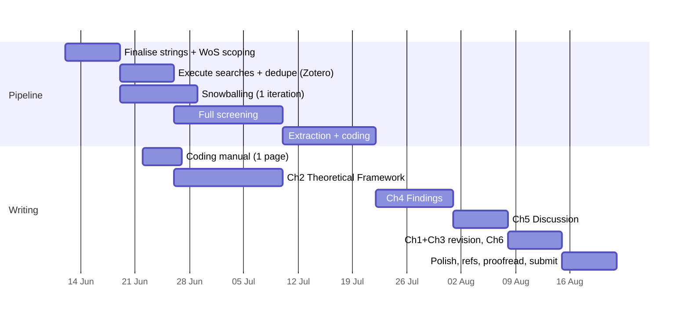

---
tags:
  - MSc_PPM
  - Dissertation_MSc
---

# Writing Plan v1 — Agentic Task Decomposition

**Created:** 11 June 2026 · **Updated:** 12 July 2026
**Status:** Active — Screening COMPLETE (151 Include / 723 Exclude). Next: Zotero import + full-text retrieval.
**Hard constraint:** 13,750 words max, 100% of grade. Submission deadline: **13 August 2026** (confirmed).

---

## 1. Target structure & word budget

| Ch. | Title | Words | Source material | Status |
|---|---|---|---|---|
| 1 | Introduction: The Algorithm and the City | 1,500 | Revised formative (cut ~40%, add bridge ¶ + provisional policy landing zone) | Drafted, needs trim |
| 2 | Theoretical Framework | 2,500 | Arrow · Deleuze/De Landa · Michael · King/Graham/Weizman — organised around **one primary axis: disciplinary → control** | Fragments only |
| 3 | Methodology | 2,500 | Revised formative methods + completed PRISMA ns + calibration narrative from `SLR.log.md` | Drafted, needs tense shift to past + real ns |
| 4 | Findings: The Systematic Map | 3,500 | SLR extraction output | Blocked on full-text retrieval |
| 5 | Discussion | 2,250 | Findings × framework; the A/B convergence-gap finding; policy implications | Not started |
| 6 | Conclusion & Research Agenda | 1,250 | Discussion + limitations | Not started |
| — | Front/back matter, AI statement | 250 | — | Template exists |
| | **Total** | **13,750** | | |

**Structural decisions (confirmed):** the SLR *is* the data; Chapter 2 is a *theoretical framework*, not a conventional literature review — avoids duplicating Chapter 4. Screening tooling: Zotero only (Rayyan dropped). LaTeX `final-draft/` directory created at repo root as the submission pipeline.

---

## 2. Phase plan (week-by-week)

**Current position (12 Jul):** p5 (screening) complete. Moving into p6 (extraction + coding) and w0/w1 (coding manual + Ch2 drafting) in parallel.

**Revised timeline to deadline (13 Aug = 32 days):**
| Phase | Sub-phase | Days | Dates |
|---|---|---|---|
| 1 | Full-text retrieval + Zotero import | 3 | 12–14 Jul |
| 2 | Snowballing from anchors | 5 | 12–16 Jul |
| 3 | Extraction + coding (151 papers) | 10 | 15–24 Jul |
| 4 | Ch2 Theoretical Framework writing | 14 | 12–25 Jul |
| 5 | Ch4 Findings (descriptive stats + synthesis) | 10 | 25 Jul – 3 Aug |
| 6 | Ch5 Discussion + Ch6 Conclusion | 7 | 3–10 Aug |
| 7 | Ch1+Ch3 revision, references, AI statement | 2 | 10–12 Aug |
| 8 | Polish, proofread, submit | 1 | 12–13 Aug |

**Contingency:** if full-text retrieval reveals >~80 papers with retrievable full text, narrow extraction scope (date-weighted sampling or tightened relevance). Finalise rule with Craig before extraction begins.

---

## 3. Agentic task decomposition

### Author-only (substantive intellectual work — never delegated)
- All screening include/exclude decisions ✓ (done)
- All coding judgements
- The argument: thesis, interpretation of findings, discussion claims
- Final wording of every paragraph (agent drafts are raw material)
- Supervision meetings and decisions arising

### Agent-delegable (with author review)
| Task | When | Notes |
|---|---|---|
| Citation verification sweep | Continuous; final pass wk of submission | Flag `[VERIFY]` items |
| Reference list formatting & deduplication | Phase p2; final week | Match existing author-date style |
| PRISMA diagram updates from real ns | After p5, p6 | Mermaid, theme-neutral |
| `SLR.log.md` iteration entries | Each calibration | Append-only; author confirms counts |
| Consistency passes (British English, terminology, tense) | After each chapter draft | esp. Ch3 future→past tense shift |
| Word-budget tracking per chapter | Weekly | Report drift > 10% |
| Extraction spreadsheet scaffolding | p6 | Columns: year, discipline, geography, doc type, codes |
| Descriptive statistics + charts from extraction | w2 | Counts by theme × year for longitudinal claim |
| Draft-zero prose for mechanical sections (e.g., PRISMA narration) | w2, w4 | Flagged for authorial rewrite per AI statement |
| Meeting agendas + email drafts | As needed | Established pattern |

### Standing agent workflows
1. **Pre-edit protocol:** re-read target file immediately before editing (Obsidian churn); fall back to scripted replace.
2. **Checkpoint commits** at each phase boundary with descriptive messages.
3. **Never touch:** frozen formative; `SLR.log.md` history.

---

## 4. Open questions (carry to next supervision)

1. Corpus-size contingency rule — if >80 papers with retrievable full text, agree narrowing mechanism. (Needed *before* extraction.)
2. Should we schedule one more supervision slot before submission?

---

## 5. Immediate tasks (12 Jul – 14 Jul)

| Priority | Task | Who | Notes |
|---|---|---|---|
| **High** | Import `Included_151_records.ris` into Zotero | Author | File ready in `Literature [.RIS]/deduplicated/` |
| **High** | Begin full-text PDF retrieval | Author | ~151 papers to locate; prioritise online access via Glasgow Uni |
| **Medium** | Run snowballing from anchor texts (Graham 2006, Kitchin 2014, Weizman 2007) | Author + Agent | Agent can format candidate lists from reference PDFs |
| **Medium** | Draft extraction/coding spreadsheet columns + codebook | Agent | Propose coding scheme for author review |
| **Low** | Draft agenda for next supervision slot | Agent | Open questions + screening progress summary |
| **Low** | Write AI-use statement draft from AGENTS.md conventions | Agent | Place in `final-draft/dissertation.tex` appendix A |
| **Medium** | Draft Ch2 outline (full section map) | Agent | Structuring Arrow → Deleuze → De Landa → Michael → King/Graham/Weizman narrative arc |

## 6. Completed milestones

- [x] Search strings finalised + calibrated (Iteration 1, 11 Jun)
- [x] WoS + Scopus searches executed (3 Jul)
- [x] Policy Commons grey literature search executed (3 Jul)
- [x] All RIS files deduplicated (874 unique records)
- [x] AI-assisted title/abstract screening (DS4-flash, temp 0.0) — 151 Include
- [x] `Included_151_records.ris` and tagged variant verified correct
- [x] SLR.log.md captures full calibration + execution history

## 7. Version history

- **v1.2 (12 Jul 2026):** Screening complete milestone added. Revised phase plan + immediate tasks for 12–14 Jul. Contingency rule added. Completed milestones section. Gordon-clarke.
- **v1.1 (30 Jun 2026):** Rayyan/pilot-screen removed, `final-draft/` LaTeX directory created.
- **v1 (11 Jun 2026):** Initial decomposition. Pending supervision review.
