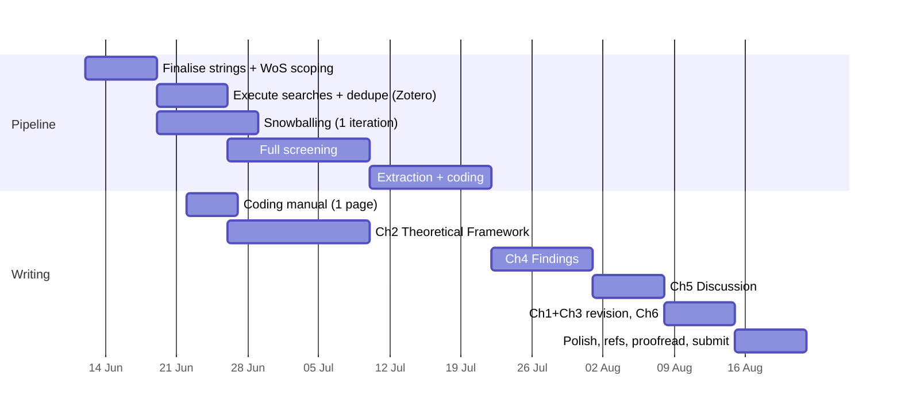

---
tags:
  - MSc_PPM
  - Dissertation_MSc
---

# Writing Plan v1 — Agentic Task Decomposition

**Created:** 11 June 2026 · **Updated:** 30 June 2026
**Status:** Active — Rayyan dropped; pilot screening removed; `final-draft/` (LaTeX) initiated
**Hard constraint:** 13,750 words max, 100% of grade. Submission deadline `[VERIFY — confirm exact date with Craig Friday; assumed mid-August 2026]`.

---

## 1. Target structure & word budget

| Ch. | Title | Words | Source material | Status |
|---|---|---|---|---|
| 1 | Introduction: The Algorithm and the City | 1,500 | Revised formative (cut ~40%, add bridge ¶ + provisional policy landing zone) | Drafted, needs trim |
| 2 | Theoretical Framework | 2,500 | Arrow · Deleuze/De Landa · Michael · King/Graham/Weizman — organised around **one primary axis: disciplinary → control** | Fragments only |
| 3 | Methodology | 2,500 | Revised formative methods + completed PRISMA ns + calibration narrative from `SLR.log.md` | Drafted, needs tense shift to past + real ns |
| 4 | Findings: The Systematic Map | 3,500 | SLR extraction output | Blocked on screening |
| 5 | Discussion | 2,250 | Findings × framework; the A/B convergence-gap finding; policy implications | Not started |
| 6 | Conclusion & Research Agenda | 1,250 | Discussion + limitations | Not started |
| — | Front/back matter, AI statement | 250 | — | Template exists |
| | **Total** | **13,750** | | |

**Structural decisions (confirmed):** the SLR *is* the data; Chapter 2 is a *theoretical framework*, not a conventional literature review — avoids duplicating Chapter 4. Screening tooling: Zotero only (Rayyan dropped). Pilot 10% screen removed (single-reviewer mitigations reduced to decision journal alone). LaTeX `final-draft/` directory created at repo root as the submission pipeline.

---

## 2. Phase plan (week-by-week)l

**Key scheduling logic:**
- **Ch2 is written in parallel with screening** (it doesn't depend on SLR output) — this is the slack in the system. If screening overruns, Ch2 is already banked.
- **Contingency:** if final corpus > ~120 papers at full-text stage, invoke pre-agreed narrowing (date-weighted sampling or tightened relevance criterion) — decide rule with Craig *before* screening, log in `SLR.log.md`.

---

## 3. Agentic task decomposition

### Author-only (substantive intellectual work — never delegated)
- All screening include/exclude decisions; all coding judgements
- The argument: thesis, interpretation of findings, discussion claims
- Final wording of every paragraph (agent drafts are raw material)
- Supervision meetings and decisions arising

### Agent-delegable (with author review)
| Task | When | Notes |
|---|---|---|
| Citation verification sweep (every ref. resolves to a real work) | Continuous; final pass wk of submission | Flag `[VERIFY]` items |
| Reference list formatting & deduplication | Phase p2; final week | Match existing author-date style |
| PRISMA diagram updates from real ns | After p5, p6 | Mermaid, theme-neutral |
| `SLR.log.md` iteration entries (drafted from author's notes) | Each calibration | Append-only; author confirms counts |
| Consistency passes (British English, terminology, tense) | After each chapter draft | esp. Ch3 future→past tense shift |
| Word-budget tracking per chapter | Weekly | Report drift > 10% |
| Decision-journal templating for borderline screening calls | p5 | Author fills content |
| Extraction spreadsheet/Review Map scaffolding | p6 | Columns: year, discipline, geography, doc type, codes |
| Descriptive statistics + charts from Review Map | w2 | Counts by theme × year for longitudinal claim |
| Draft-zero prose for mechanical sections (e.g., PRISMA narration) | w2, w4 | Flagged for authorial rewrite per AI statement |
| Meeting agendas + email drafts | As needed | Established pattern |

### Standing agent workflows
1. **Pre-edit protocol:** re-read target file immediately before editing (Obsidian churn); fall back to scripted replace.
2. **Checkpoint commits** at each phase boundary with descriptive messages.
3. **Never touch:** frozen formative; `SLR.log.md` history.

---

## 4. Open questions (carry to next supervision)

1. Submission deadline — exact date? `[VERIFY]`
2. Corpus-size contingency rule — agree narrowing mechanism now.
3. Overton outcome — shapes whether grey lit is a full strand or a bounded supplement.
4. One more supervision slot before submission — book it.

---

## 5. Tomorrow's tasks (Wed 1 July)

| Priority | Task | Who | Notes |
|---|---|---|---|
| High | Begin title/abstract screening pass | Author | Corpus is deduped in Zotero; screen against criteria in §3 of methods |
| High | Continue Ch2 Theoretical Framework drafting | Author | Target: finish King/Graham/Weizman section by end of week |
| Medium | Log snowballing results in `SLR.log.md` | Agent | Append-only; author confirms counts |
| Medium | Set up decision journal template | Agent | Simple table: record ID, title, reason for borderline flag, resolution |
| Low | Draft agenda for next supervision slot | Agent | Open questions 1–4 from §4 + screening progress update |
| Low | Write AI-use statement draft from AGENTS.md conventions | Agent | Place in `final-draft/dissertation.tex` appendix A |

## 6. Version history

- **v1 (30 Jun 2026):** Rayyan/pilot-screen removed, `final-draft/` LaTeX directory created, task list for 1 Jul added.
- **v0 (11 Jun 2026):** Initial decomposition. Pending supervision review.
