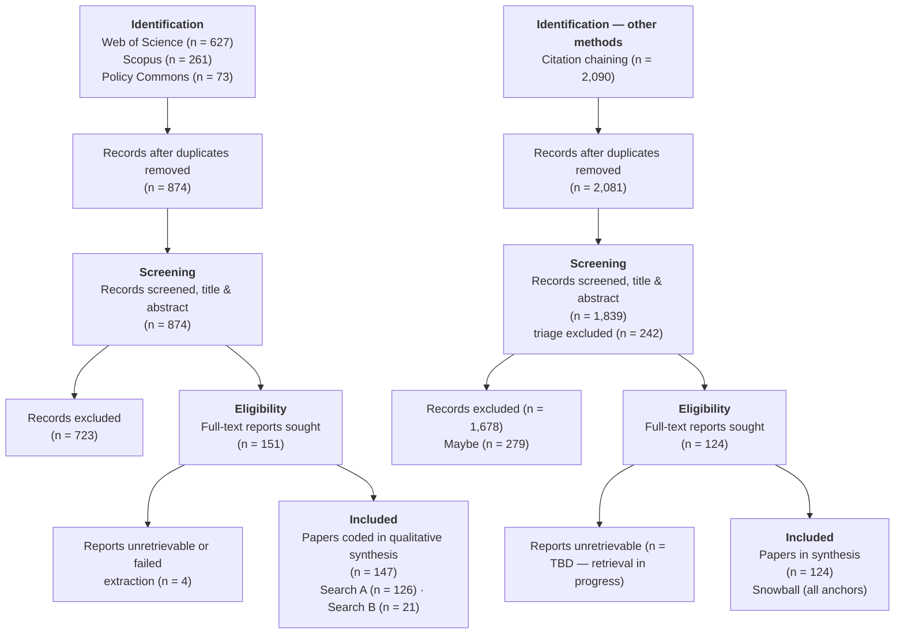

---
tags:
  - MSc_PPM
  - Dissertation_MSc
---

# Chapter 3 — Methodology: A Systematic Mapping of the Literature on Algorithmisation, 1990–2025

**Status:** Draft two (citation chaining executed, snowball corpus incorporated, Maybes dropped) · **Word target:** ~2,500 · **Date:** 28 July 2026

---

## 3.1 Review Design

To empirically investigate the intersection of algorithmic governance, urban space, and systemic spatial destruction (domicide), this dissertation deployed a Systematic Literature Review (SLR). To avoid the epistemological pitfalls of a traditional narrative review — which inherently risks selection bias and the "cherry-picking" of sources to validate a pre-existing theoretical critique — the SLR provides a transparent, auditable, and reproducible mechanism for data collection. This aligns with the "evidence turn" in contemporary public policy and management, which increasingly demands structured methodologies to track policy evolution and evaluate "what works" (Tranfield et al., 2003). Rather than evaluating the effectiveness of a specific policy intervention, however, the review was adapted to rigorously map a longitudinal *discursive shift*: how global academic discourse and policy literature conceptualised algorithms, big data, and spatial surveillance over three and a half decades.

The review was conducted between June and July 2026. Search execution, screening, full-text retrieval, and thematic coding were each logged with timestamps, record counts, and tooling versions; every stage from search execution to final inclusion is reported below and summarised in a completed PRISMA flow diagram (Figure 3.1), rendering the final corpus fully auditable.

---

## 3.2 Conceptual Scope and Research Questions

The core premise motivating the search parameters is the hypothesis that the *algorithmisation* of public policy possesses an inherently dual-use nature that distinguishes it fundamentally from the management of physical urban infrastructure. While the build-out of legacy urban assets — highways, rail networks, gas terminals — requires massive capital expenditure, physical friction, and explicit geographic constraint, software operates under entirely different economic mandates. Following Arrow's (1962) analysis of the "information good" (developed fully in Chapter 2), software is characterised by a high initial cost of development but a near-zero marginal cost of reproduction and deployment: a geographic information system (GIS) or behavioural-prediction algorithm designed for civilian urban planning can be frictionlessly retrofitted for military targeting or spatial unmaking without new physical supply chains. The review was designed to test whether — and how — this phenomenon has been recognised, debated, or obfuscated in the literature. The concrete policy stakes of that question are set out in Chapter 1 (§1.3) and are not repeated here.

The research questions are stated in full in Chapter 1 (§1.3). Operationalised for the review, they required the collected literature to speak to two things at once: the dual-use nature of algorithmic technologies in urban governance, specifically in contrast to physical infrastructure (RQ1); and the shift from institutional, disciplinary management of urban space to algorithmic, modulatory control, insofar as that shift is implicated in systemic urban destruction or domicide (RQ2). By placing Arrow's information good in dialogue with the Deleuzian hypothesis of societal control, these questions established a rigid perimeter for the search, ensuring the collected data spoke directly to the dual-use nature of spatial analytics and the compromised integrity of the private dwelling (King, 2004).

---

## 3.3 Search Strategy

### 3.3.1 Databases and date range

The review interrogated a 35-year chronological window, 1990–2025. This expansive range was a deliberate methodological necessity, allowing the review to track the literature across several distinct technological epochs: the early internet and digitisation of municipal records (circa 1990s), the foundational build-out of Web 1.0, the rise of ubiquitous data harvesting and Big Data in Web 2.0, the decentralised shifts of Web 3.0, and the precipice of the ongoing Fourth Industrial Revolution defined by generative AI and autonomous systems.

Peer-reviewed literature was sourced from **Web of Science** and **Scopus**, chosen for their breadth across the social sciences, urban planning, and defence studies. Grey literature was sourced from **Policy Commons**, supplemented by targeted manual searches of key institutional repositories (RAND Corporation, Chatham House, Urban Displacement Project), mirroring the dual-search structure below and emphasising policy documents, parliamentary records, defence white papers, and think-tank outputs explicitly addressing the dual-use implications of urban data technologies.[^1]

### 3.3.2 Dual-search design

Given the cross-cutting nature of the inquiry — bridging urban analytics, security studies, and spatial destruction — a single search string risked being either too restrictive (capturing only papers sitting directly at the intersection of all three domains) or analytically shallow (returning noise without structure). The review therefore deployed **two complementary search strategies, merged at the deduplication stage**.

**Search A — Civil–military urban technology nexus (high recall):** designed to surface the broader landscape of how algorithmic governance, smart city infrastructure, and urban analytics intersect with military, surveillance, and security apparatuses. Final keyword clusters: `("algorithmic governance" OR "urban analytics" OR "smart cit*" OR "platform urbanism" OR "predictive policing" OR "urban big data" OR "data-driven urbanism") AND ("dual-use" OR "civil-military" OR "military" OR militari* OR "national security" OR securitis* OR securitiz* OR weaponi* OR warfare OR "state surveillance" OR "mass surveillance" OR "OSINT")`.

**Search B — Spatial destruction and the datafied city (high precision):** designed to capture literature specifically addressing how algorithmic and data-driven tools are implicated in urbicide, domicide, and spatial violence. Final keyword clusters: `("domicide" OR "urbicide" OR "spatial violence" OR "home unmaking" OR "urban destruction" OR "urban warfare") AND ("data" OR "algorithm" OR "AI" OR "surveillance" OR "GIS" OR "remote sensing")`.

This dual-search approach ensured that papers theorising the surveillance–governmentality nexus (which might not explicitly invoke "domicide") and papers documenting spatial destruction (which might not deploy the language of "algorithmic governance") were both captured. The convergence — or absence of convergence — between the two literatures was itself a phenomenon the review was designed to surface.[^2] Exact platform-specific strings (Web of Science `TS=`, Scopus `TITLE-ABS-KEY`, Policy Commons `title:`/`summary:` fielding) are archived in the SLR log for reproducibility.

### 3.3.3 Calibration

Search strings were calibrated through documented scoping iterations. An initial Scopus formulation of Search A returned **9,981 records** — unmanageable for single-author screening. Diagnosis identified four generic terms driving cross-disciplinary noise: `"big data"` (matching every data-science paper regardless of policy relevance), bare `"security"` (capturing the IoT and network-cybersecurity engineering literature), bare `"targeting"` (matching marketing, ad-tech, and pharmaceutical usage), and bare `"surveillance"`. These were replaced with the qualified equivalents and truncated stems shown above, and a date-boundary error that would have excluded 1990 and 2025 was corrected.

Policy Commons required separate calibration. Initial strings returned **13,096** (Search A) and **3,031** (Search B) hits, owing to automatic stemming and full-text indexing across a broad grey corpus; both searches were revised to fielded formulations (Search A: both legs in the summary field; Search B: spatial-destruction terms in title, data terms in summary), returning 63 and 10 exportable records respectively.

All searches were executed on **3 July 2026**. Raw and deduplicated counts by source:

| Source | Search A | Search B |
|---|---|---|
| Web of Science | 486 | 141 |
| Scopus (deduplicated across subject-area exports) | 219 | 42 |
| Policy Commons (grey literature) | 63 | 10 |
| **Total identified** | **768** | **193** |

### 3.3.4 Citation chaining

As a keyword-independent safeguard against vocabulary blind spots introduced by calibration, one iteration of backward and forward citation chaining ("snowballing"; Wohlin, 2014) was executed from **four anchor texts** (the three provisionally named in the protocol — Graham, 2006; Kitchin, 2014; Weizman, 2007 — plus Michael, 2007, which is central to the theoretical framework). The pass was executed via **OpenAlex** between 19 and 28 July 2026, using the same date range (1990–2025), language (English), and document-type filters as the database searches.

Backward chaining was possible only for the two journal-article anchors (Kitchin, 2014: 33 filtered references; Michael, 2007: 8 filtered references), because OpenAlex indexes no reference lists for the two monographs (Graham, 2006; Weizman, 2007). Forward chaining returned substantially more material: Kitchin (1,498 citing works), Weizman (338), Graham (238), and Michael (17), for a combined raw pool of 2,090 candidates. After deduplication against the main corpus (9 duplicates removed), **2,081 unique records** remained.

Snowball candidates were enriched for missing abstracts via the Springer META API (217 of 225 Springer DOIs recovered) and an OpenAlex re-scan (18 of 224 remaining DOIs recovered). Records with no retrievable abstract (242) were excluded at triage, mirroring the main pipeline rule. The remaining 1,839 records were screened by title and abstract using the same AI-assisted workflow, prompt, model, and parameters as the database searches (DeepSeek V4 Flash; temperature 0.0; §3.4.3), yielding **124 Includes**, 1,678 Excludes, and 279 Maybes.

The 279 Maybe records were **dropped without manual review**. They represent 13% of the snowball pool — comparable to the main corpus's Maybe rate (17%) — and their titles and sources indicate predominantly tangential material: urban governance papers mentioning surveillance in passing, general smart-city critiques without dual-use relevance, and methodological pieces about big data without policy or spatial dimensions. The 124 Includes already represent a substantial snowball corpus (82% the size of the 151-record database corpus), and the time cost of manually resolving 279 borderline records was disproportionate to the expected marginal gain. This decision is disclosed as a limitation in §3.6.

The final snowball corpus of 124 records is composed of: Weizman 2007 forward (46), Kitchin 2014 forward (42), Graham 2006 forward (38), Kitchin 2014 backward (0), Michael 2007 forward (0), Michael 2007 backward (0). Notably, 2 records arrived via multiple anchors. The complete pipeline, counts, and screening prompt are archived in the SLR log and `analysis/snowball/` directory.

---

## 3.4 Screening and Selection

### 3.4.1 Deduplication and corpus assembly

Results from all six searches were exported to **Zotero** for reference management and deduplication. Of 963 compiled records, 89 duplicates were removed (80 matched by DOI, 9 by fuzzy title matching), leaving **874 unique records**: 698 from Search A and 176 from Search B. Notably, zero records appeared in both searches at this stage — an early signal of the discursive separation that Chapter 4 develops as a central finding. [VERIFY: source tables sum to 961 identified records, while the deduplication log records 963 compiled — a 2-record discrepancy to reconcile before submission.]

### 3.4.2 Inclusion and exclusion criteria

Records were screened against written criteria fixed in advance. *Inclusion:* (a) peer-reviewed journal articles, book chapters, or authoritative theoretical texts, or (b) substantive policy documents (white papers, parliamentary reports, think-tank analyses) from identifiable institutional authors; published within 1990–2025; and explicitly addressing the intersection of data technology with public policy, civic governance, urban space, or state control. *Exclusion:* literature focused purely on the technical, mathematical, or computational mechanics of software engineering without applied reference to public policy, civic governance, the urban environment, or defence strategy; editorials, conference abstracts without full papers, and journalistic commentary; and non-English-language articles without high-quality translations (acknowledged in §3.6). *Quality appraisal:* peer-reviewed status served as the baseline threshold for academic literature; grey literature was appraised using the AACODS checklist (Authority, Accuracy, Coverage, Objectivity, Date, Significance) to filter advocacy material lacking evidentiary grounding (Tyndall, 2010).

### 3.4.3 Single-reviewer screening with AI assistance

As a single-author dissertation, conventional dual-reviewer screening was not feasible. Screening was therefore conducted by the author with AI assistance: a large-language-model classifier (DeepSeek V4 Flash; temperature 0.0 for deterministic output) assigned include/exclude verdicts against the written criteria, working through triage priority bands (195 HIGH, 326 MEDIUM, 276 LOW, with 77 records excluded at triage for absent or vestigial abstracts). Borderline cases were logged in a decision journal and resolved against the written criteria rather than ad hoc judgement; doctoral dissertations were identified and excluded on manual review, while full conference papers were retained as eligible. This workflow is disclosed in full in the Appendix (AI-use statement); all verdicts remained the author's responsibility. [AUTHOR CONFIRM: this describes the actual human-AI division of labour in screening — adjust to match your process.]

### 3.4.4 Screening results

Of 874 records screened by title and abstract, **151 were included** (17.2%) and 723 excluded.

Snowball screening followed the same protocol and criteria. Of 2,081 unique citation-chained candidates (242 triage-excluded for no abstract, 1,839 screened), **124 were included** (6.7% of screened), 279 marked Maybe (dropped; §3.3.4), and 1,678 excluded. The combined corpus across both identification streams totals **275 records**: 151 from database searches and 124 from citation chaining.

---

## 3.5 Full-Text Retrieval and Thematic Coding

Full texts were retrieved and managed in Zotero; 145 records yielded extractable PDFs, three proved unretrievable, and one failed during extraction, leaving **147 papers** for coding from the database-search corpus. Extracted texts were logged in a Systematic Review Map recording each text's publication year, discipline, geographic focus, document type, and conceptual orientation.

For the snowball corpus, 123 of 124 records required fresh PDF retrieval (only 1 overlapped with the database-search PDFs); this retrieval was in progress at the time of writing and is noted in the limitations (§3.6).

Coding combined deductive structure with inductive openness. Four themes, derived from the theoretical framework in Chapter 2, guided extraction, each scored on a 0–3 scale (absent → central):

1. **The Information Good and Dual-Use Fluidity** — recognition of the near-zero marginal cost of algorithmic tools and their frictionless translation from civilian urban technology to military application (Arrow, 1962).
2. **Epistemic Authority and Black-Boxing** — deference by civilian policymakers to the seeming objectivity of military or corporate data systems (Michael, 2007; Pasquale, 2015).
3. **The Machinic City and Modulation** — conceptualisation of urban populations and housing as dynamic, targetable data fields rather than static infrastructure (Deleuze, 1990; De Landa, 1992, 2014).
4. **Spatial Collapse and Home Unmaking** — explicit connection of weaponised urban planning and algorithmic zoning tools to displacement, urbicide, and the infringement of the private dwelling (King, 2004; Graham, 2006, 2011; Weizman, 2007).

Supplementary fields captured dual-use explicitness, direction, and structural framing, plus methodology, geography, thesis, key quotations, and policy relevance. Because the review tracks a *longitudinal* discursive shift, every coded theme was additionally plotted against publication date, enabling the synthesis to identify when — and in which discourse communities — dual-use awareness emerges, peaks, or disappears across the 1990–2025 window.

Coding was executed by the author with AI assistance under the same disclosure terms as screening: the model scored papers in resumable batches against a written codebook (temperature 0.0), with per-paper JSON outputs retained for qualitative review; very long texts were sampled under a documented truncation rule (introduction, middle sections, conclusion). All coding judgements remained the author's responsibility and are disclosed in the Appendix. [AUTHOR CONFIRM: as with screening — confirm the workflow description matches practice.]

---

## 3.6 Synthesis Approach and Limitations

The synthetic phase bridges the empirical literature map back to the theoretical framework of Chapter 2. Rather than a quantitative meta-analysis — inappropriate for qualitative policy discourse — the synthesis combines descriptive statistics of theme distributions with qualitative deep-dives into the small set of "bridge" papers scoring across all four themes, testing whether the literature has registered the connections the framework proposes. The results culminate in Chapter 6 with an evidence-backed agenda for future research into public policy frameworks capable of asserting civilian, democratic oversight over algorithmic urban governance.

Five limitations are acknowledged. First, the **English-language restriction** risks under-representing discourse from non-Anglophone policy communities — particularly relevant given the geographic foci of the case material — and is flagged wherever the synthesis makes global claims. Second, **single-reviewer screening and coding**, while mitigated by deterministic AI assistance, written criteria, and decision journaling, cannot fully replicate the inter-rater reliability of team-based reviews. Third, **grey-literature indexing is structurally uneven**: classified or restricted defence documents are by definition absent, so the review maps the *public* policy discourse only; reliance on Policy Commons after the lapse of the Overton trial licence further constrains grey-literature coverage.[^1] Fourth, **backward citation chaining was possible only for journal-article anchors**: OpenAlex indexes no reference lists for the two monographs (Graham, 2006; Weizman, 2007), so the backward pass drew only from Kitchin (2014) and Michael (2007). Fifth, **279 Maybe-verdict snowball records were dropped without manual review** (§3.3.4); the titles and sources of these records suggest predominantly tangential material, but some keyword-invisible relevant records will have been missed, and the 124-record snowball corpus cannot be treated as exhaustive of the citation network. Each limitation constrains the scope of the claims the synthesis can support, and the conclusion is calibrated accordingly.

---

## Figure 3.1 — PRISMA flow diagram

---

## Reference list (for this chapter)

Arrow, K.J., 1962. Economic welfare and the allocation of resources for invention, in: The Rate and Direction of Inventive Activity: Economic and Social Factors. Princeton University Press, pp. 609–626.

De Landa, M., 1992. *War in the Age of Intelligent Machines*. Zone Books.

De Landa, M., 2014. *Intensive Science and Virtual Philosophy*. Bloomsbury.

Deleuze, G., 1990. Postscript on the societies of control. *October* 59, 3–7.

Graham, S., 2006. Cities, war, and terrorism: Towards an urban geopolitics. In: Graham, S. (Ed.), *Cities, War, and Terrorism: Towards an Urban Geopolitics*. Blackwell, pp. 1–42. [VERIFY page range]

Graham, S., 2011. *Cities Under Siege: The New Military Urbanism*. Verso.

King, P., 2004. *Private Dwelling*. Routledge. <https://doi.org/10.4324/9780203421406>

Kitchin, R., 2014. Big Data, new epistemologies and paradigm shifts. *Big Data & Society* 1, 2053951714528481.

Michael, K., 2007. The Israel Defense Forces as an epistemic authority: An intellectual challenge in the reality of the Israeli–Palestinian conflict. *Journal of Strategic Studies* 30, 421–446. <https://doi.org/10.1080/01402390701343417>

Page, M.J., McKenzie, J.E., Bossuyt, P.M., Boutron, I., Hoffmann, T.C., Mulrow, C.D., et al., 2021. The PRISMA 2020 statement: An updated guideline for reporting systematic reviews. *BMJ* 372, n71. <https://doi.org/10.1136/bmj.n71>

Pasquale, F., 2015. *The Black Box Society: The Secret Algorithms That Control Money and Information*. Harvard University Press.

Tranfield, D., Denyer, D., Smart, P., 2003. Towards a methodology for developing evidence-informed management knowledge by means of systematic review. *British Journal of Management* 14, 207–222.

Tyndall, J., 2010. AACODS Checklist. Flinders University, Adelaide.

Weizman, E., 2007. *Hollow Land: Israel's Architecture of Occupation*. Verso.

Wohlin, C., 2014. Guidelines for snowballing in systematic literature studies and a replication in software engineering, in: Proceedings of the 18th International Conference on Evaluation and Assessment in Software Engineering (EASE '14). ACM, pp. 1–10. <https://doi.org/10.1145/2601248.2601268>

[^1]: The original search plan included Overton for grey-literature discovery, accessed via a University of Glasgow trial licence. The trial lapsed on 29 June 2026 and was not renewed; the grey-literature component therefore rests on Policy Commons supplemented by targeted manual searches of institutional repositories (RAND Corporation, Chatham House, Urban Displacement Project).
[^2]: The record counts returned by Search A and Search B informed the calibration of Boolean operators and keyword clusters, documented in §3.3.3. All search strings, dates of execution, and raw record counts are archived in the SLR log (`Diss_Methods_Data/SLR.log.md`) to guarantee reproducibility.
